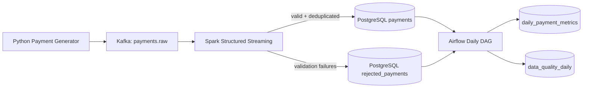

# Real-Time Payment Analytics & Data Quality Platform

An in-progress data engineering project that combines **Kafka**, **Spark Structured Streaming**, **Airflow**, **PostgreSQL**, and **Docker** to model real-time payment ingestion, validation, scheduled reconciliation, and data-quality reporting.

> Status: active development. The current repository includes the event generator, Kafka/PostgreSQL infrastructure, Spark streaming job, SQL schema, Airflow DAG, and CI checks. Production-hardening items are intentionally tracked as roadmap work.

## Architecture



## What the MVP demonstrates

- Streaming ingestion through Kafka.
- Spark Structured Streaming JSON parsing with Kafka partition/offset traceability.
- Required-field, amount, status, payment-method, country, and currency validation.
- Explicit micro-batch sizing and JDBC write-partition control.
- Retention of invalid records with rejection reasons.
- PostgreSQL persistence and daily aggregate tables.
- Airflow orchestration for reconciliation and data-quality summaries.
- Dockerized local Kafka/PostgreSQL infrastructure.
- GitHub Actions linting and unit tests.

## Event shape

```json
{
  "transaction_id": "9c6f...",
  "customer_id": "cust-00124",
  "merchant_id": "merchant-0017",
  "amount": 84.39,
  "currency": "USD",
  "event_time": "2026-08-15T08:00:00+00:00",
  "payment_method": "CARD",
  "status": "CAPTURED",
  "country": "US"
}
```

## Repository layout

```text
.
├── airflow/dags/payment_quality_dag.py
├── docs/architecture.md
├── scripts/create_topic.sh
├── sql/init.sql
├── src/
│   ├── common/payment_rules.py
│   ├── producer/generate_payments.py
│   └── streaming/payment_stream.py
├── tests/test_generator.py
├── docker-compose.yml
├── Makefile
└── requirements.txt
```

## Quick start

### 1. Prerequisites

- Docker + Docker Compose
- Python 3.11+
- Java 17+
- Apache Spark 4.2.x available locally (`spark-submit` on PATH)

### 2. Start Kafka and PostgreSQL

```bash
cp .env.example .env
docker compose up -d
./scripts/create_topic.sh
```

### 3. Create a Python environment

```bash
python -m venv .venv
source .venv/bin/activate
pip install -r requirements.txt
```

### 4. Start the Spark stream processor

The Kafka connector and PostgreSQL JDBC driver are added at submit time:

```bash
spark-submit \
  --packages org.apache.spark:spark-sql-kafka-0-10_2.13:4.2.0,org.postgresql:postgresql:42.7.13 \
  src/streaming/payment_stream.py
```

### 5. Generate events

In another terminal:

```bash
source .venv/bin/activate
python -m src.producer.generate_payments \
  --count 1000 \
  --rate 25 \
  --invalid-rate 0.03 \
  --duplicate-rate 0.02
```

### 6. Inspect results

```bash
docker compose exec postgres psql -U payments -d payments \
  -c "SELECT status, COUNT(*), ROUND(SUM(amount), 2) FROM payments GROUP BY status ORDER BY status;"

docker compose exec postgres psql -U payments -d payments \
  -c "SELECT reason, COUNT(*) FROM rejected_payments GROUP BY reason ORDER BY COUNT(*) DESC;"
```

## Airflow

The DAG is in `airflow/dags/payment_quality_dag.py` and targets **Airflow 3.x** using the stable `airflow.sdk` authoring API. For local Airflow, use the official Docker Compose quick-start, mount this repository's `airflow/dags` directory, install `psycopg2-binary`, and pass the PostgreSQL environment variables from `.env`.

The DAG runs daily and performs two tasks:

1. Upsert payment counts and amounts by date/status.
2. Upsert valid/rejected counts and calculate a rejection rate.

## Data-quality rules

Current rules reject events when they contain:

- missing transaction/customer/merchant identifiers;
- non-positive amounts;
- invalid currency/country code lengths;
- missing event timestamps;
- unsupported payment status;
- unsupported payment method.

Duplicate handling is intentionally deferred to the upcoming stateful-processing milestone, where watermark semantics and recovery behavior will be implemented and tested together.

## Testing

```bash
pip install -r requirements-dev.txt
pytest -q
ruff check src tests airflow/dags
```

## Roadmap

- [ ] Add automated integration test covering Kafka → Spark → PostgreSQL.
- [ ] Publish streaming throughput and latency benchmark results.
- [ ] Add Grafana dashboard and Prometheus-compatible metrics.
- [ ] Route rejected records to a dedicated Kafka dead-letter topic for replay.
- [ ] Add schema evolution / Schema Registry support.
- [ ] Add Kubernetes manifests or Helm chart for a local cluster.
- [ ] Add FastAPI read API for quality metrics and pipeline status.

## Why this project

The goal is to practice the boundary between **backend engineering and data-platform engineering**: streaming ingestion, distributed processing, data quality, batch orchestration, persistence, testing, and operability in one small system that can be run locally and explained end-to-end.
